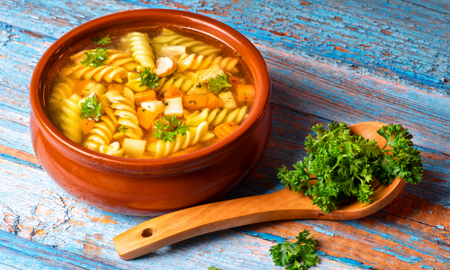

# Meine Lieblingsgericht

## Nudeln Suppe

## Zutaten für 4 Portionen

- 2	Stk	Karotte
- 1	l Wasser (heiß)
- 1	EL	Öl
- 1	Prise Salz
- 1	Prise Pfeffer
- 1	Prise Majoran
- 1	Stg	Petersilie (frisch)
- 1	EL	Schnittlauch (frisch, gehackt)
- 1	Prise	Muskat (gerieben)
- 3	Stk	Wacholderbeeren
- 50g Suppennudeln

# Zubereitung

 1.   Für die Nudelsuppe das Gemüse putzen, waschen, schneiden und die Kräuter schneiden.

 2.   Die Karotten in Stifte oder Scheiben schneiden. Im heißen Öl kurz anrösten, mit heißem Wasser aufgießen. Die Suppe mit Suppengewürz würzen und zugedeckt köcheln lassen (20 min).

 3.   Die Teigwaren in kochendes Salzwasser geben, auf kleine Flamme köcheln lassen (5 min), abseihen und kurz vor dem Servieren in die Suppe geben.

Guten Appetit!!

